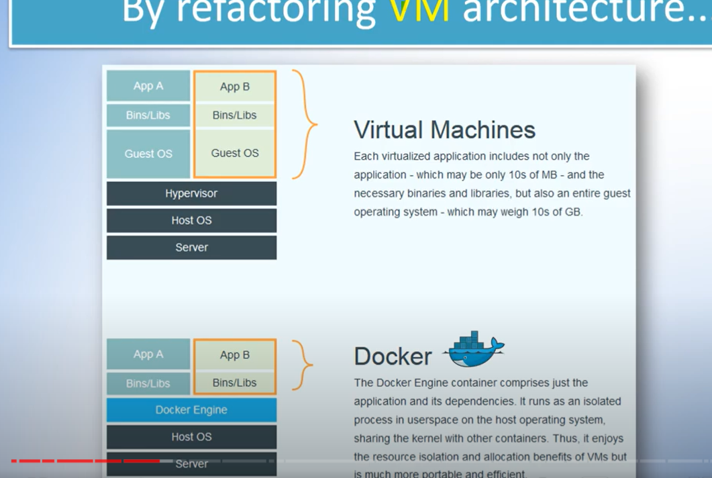
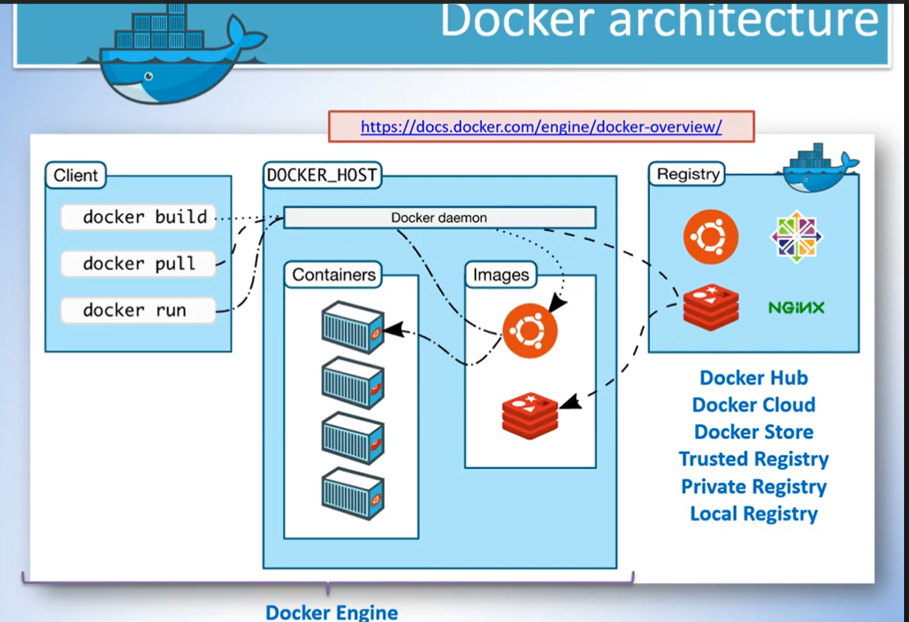

docker là gì ?
- nền tảng đóng gói sản phẩm tốt nhất thế giới, là một nền tảng cho phép lập trình viên phát triển rồi gửi đến cho chung, là 1 trong những công cụ tốt nhất 

docker làm đc gì ?
-chạy được bản đóng gói môi trường khác nhau
môi trường dev (lập trình viên) => qua môi trường UA => production 
máy mà dev dùng k hoàn toàn giống

=> kết quả đat được tính thống nhất cao

contariner là gì ?
- giống cái vận chuyện chưa hàng, đơn vị chuẩn hóa để đóng gói phần mềm, container gồm 1 vài chuẩn hóa giúp chươn gtrinfh chạy tốt hôn

docker giúp đc ai ? trong tình huống nào
- dev " works on my machine"
- operator: quản lí những ứng dụng đã triển khai cho khách hàng
- doanh nghiệp: xây dựng ra những quy định phân phối sản phẩm, phát triển nhanh, an toàn

làm sao docker làm vậy được ?
- docker làm được những điều trên vì cải thiện máy ảo, dựa trên máy ảo
khi dùng máy ảo thấy ở tầng dưới có server trong máy đó mới cài host OS cần hypervisor, cho phép chạy nhiều các máy ảo, mỗi máy ảo gồm hệ điều hành khách, cài ứng dụng của mình đc trong hệ điều hành đó, có thể dùng các thứ viện
ví dụ có 2 ứng dụng A và B khi triển khai cần 2 hệ thống mới cài được ứng dụng A và B, thay thế ảo hóa bằng docker engine k cần ảo hóa và guest os

docker có khả năng chia sẻ tốt

phần bins là libs đc xài dùng
với máy ảo mỗi hệ điều hành là 1 fiel độc lớp, docker chia thày các layer, k cần tốn công tạng riêng ra tiết keijem dung lượng 
docker có sức mạnh: máy ảo, project chạy nhanh hơn máy ảo rất nhiều, có thể tải đc internet vừa nhanh vừa dễ 

